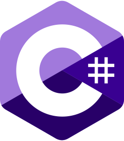

<!--
**JesusMezaDev/JesusMezaDev** is a ✨ _special_ ✨ repository because its `README.md` (this file) appears on your GitHub profile.

Here are some ideas to get you started:

- 🔭 I’m currently working on ...
- 🌱 I’m currently learning ...
- 👯 I’m looking to collaborate on ...
- 🤔 I’m looking for help with ...
- 💬 Ask me about ...
- 📫 How to reach me: ...
- 😄 Pronouns: ...
- ⚡ Fun fact: ...
-->

# ¡Hola 👋🏻! Soy [Jesús Meza](https://jesusmeza.dev/)

    
    
    
    
    
    
    
    
    
    
    
    
    
    

## Acerca de mi

Mis amigos me llaman Chuy. Desde pequeño me fascina la tecnología. +12 años de experiencia. Actualmente trabajo de manera remota en México como Full Stack Web Developer.

En mi tiempo libre me gusta ir a pescar, escuchar música y jugar videojuegos, pero lo mejor es pasar tiempo con mi familia. Aprender nuevas tecnologías y compartir lo que sé con los demás es una de las cosas que más disfruto de mi profesión.

    

## 🔧 Tecnologías y Herramientas

- **Lenguajes:** JavaScript, Typescript, C#, Visual Basic .Net
- **Frameworks:** Node.js, Nest, Astro, Vue, jQuery, Tailwind
- **Bases de Datos:** Microsoft SQL, MongoDB
- **Versionamiento:** Git, Tortoise SVN

## 🌱 Estoy aprendiendo

- React
- Micro Servicios en Nest y Net.Core

## 📫 Mándame un mensaje

- **Email:** jesusmeza.dev@gmail.com
- **LinkedIn:** [JesusMezaDev](https://www.linkedin.com/in/jesusmezadev)
- **X:** [@IngeJesusMeza](https://x.com/ingejesusmeza)

## 📈 GitHub Stats

## 🏆 GitHub Trophies

## 💬 ¡Colaboremos juntos!

Siempre estoy abierto a la colaboración y a discutir nuevas ideas. ¡No dudes en contactarme!

---

⭐️ From [JesusMezaDev](https://github.com/JesusMezaDev)
